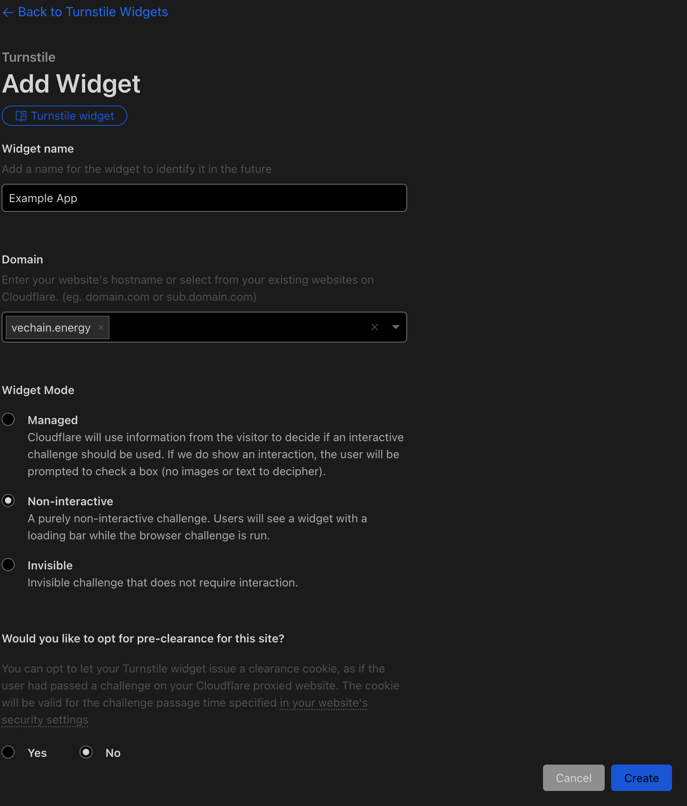

# Summary

Transactions sometimes need verification to ensure they come from human parties, which poses a challenge for smart contracts. Web applications commonly use CAPTCHAs to verify human interaction. This approach can be adapted to verify human-initiated transactions in blockchain environments.

This project contains an example implementation that can be adopted:

1. A Website requires a CAPTCHA
   - CloudFlare Turnstile is used because of its simplicity and not requiring interaction in most cases
2. A Backend verifies the CAPTCHA and signs a message, serving as a trusted source for the smart contract
   - CloudFlare Workers are used because of the simplicity of local running and deployment
3. A Smart Contract verifies the signature and allows the transaction to proceed
   - OpenZeppelin and EIP712 are used as established standards/libraries for verification


# Website with CAPTCHA

The example website is a simple React app that uses CloudFlare CAPTCHAs to verify human interaction.

Run the test app locally:

```shell
cd web-app
npm install
npm start
```

It will be available on http://localhost:1234

## CloudFlare Turnstile

Register a free CloudFlare account and setup a CAPTCHA on https://www.cloudflare.com/products/turnstile/
There are multiple options to configure improve the user experience and prevent abuse at the same time.



## React Turnstile

- To bring turnstile into your React app, use the following package: [react-turnstile](https://www.npmjs.com/package/@marsidev/react-turnstile)
- There are excellent docs about its configuration on: https://docs.page/marsidev/react-turnstile

You can use `1x00000000000000000000AA` as site key for testing.

The basic implementation looks like this:

```tsx
import { Turnstile } from "@marsidev/react-turnstile";

//..

// track captcha status for simple UI status display
const [catpchaStatus, setCaptchaStatus] = React.useState("loading");

// track captcha token for backend verification
const [captchaToken, setCaptchaToken] = React.useState("");
const handleCaptchaSuccess = (token: string) => {
  setCaptchaStatus("solved");
  setCaptchaToken(token);
};

//..

<Turnstile
  options={{
    // adjust the size to your needs, invisible will even hide the widget
    size: "invisible",
  }}
  siteKey={CAPTCHA_SITE_KEY}
  onError={() => setCaptchaStatus("error")}
  onExpire={() => setCaptchaStatus("expired")}
  onSuccess={handleCaptchaSuccess}
/>;
```

The ability to hide the widget removes the noise often seen CAPTCHAs that need to be manually solved. Try the configuration options that suites your needs best.


Find more details about the options in the docs of:

- [React Turnstile render options](https://docs.page/marsidev/react-turnstile/props#render-options)
- [Cloudflare Turnstile configuration by code](https://developers.cloudflare.com/turnstile/get-started/client-side-rendering/#execution-modes)

## Result

The result is a unique token that was generated using the CAPTCHA service and can be verified by a backend service.

# Backend Verifier and Signer

The example signer is a CloudFlare Worker that verifies the correctness of the CAPTCHA and creates a signed message that can be verified by a smart contract.

Run the backend signer locally:

```shell
cd backend-signer
npm install
npx wrangler dev
```

It will be available on http://localhost:8787

## CloudFlare Worker

CloudFlare Workers are simple serverless functions that can be deployed within a few seconds and can run locally on your machine during development.

> Learn more about CloudFlare Workers on https://developers.cloudflare.com/workers/get-started/guide/

Verifying the token is done by calling Turnstile with the Widgets secret key (created during setup of the CAPTCHA) and the token that was generated by the widget in the Web App:

```ts
// get captcha payload from web-app
const { token } = (await request.json()) as { token: string };

// verify the captcha on CloudFlare Turnstile
const captchaVerification = (await fetch(env.VERIFY_ENDPOINT, {
  method: "POST",
  body: `secret=${encodeURIComponent(
    env.CAPTCHA_SITE_SECRET_KEY
  )}&response=${encodeURIComponent(token)}`,
  headers: { "content-type": "application/x-www-form-urlencoded" },
}).then((res) => res.json())) as TurnstileServerValidationResponse;

// if captcha verification failed, return error
// optionally improve verification, for example by checking the hostname or time of the challenge
if (!captchaVerification.success) {
  return new Response(JSON.stringify(captchaVerification), {
    status: 400,
    headers: { ...corsHeaders, "content-type": "application/json" },
  });
}
```

The configuration values for the `env` variables are stored within `wrangler.toml` and are as follows in the example app:

```toml
[vars]
# Turnstile Configuration
CAPTCHA_SITE_SECRET_KEY = "1x0000000000000000000000000000000AA"
VERIFY_ENDPOINT = "https://challenges.cloudflare.com/turnstile/v0/siteverify"

# Signer Configuration
#  store this secret securely and do not share it with anyone
#  read https://developers.cloudflare.com/workers/configuration/secrets/#adding-secrets-to-your-project
#  on how to use "wrangler secret"
SIGNER_PRIVATE_KEY = "0xeee5b56c659542f88e9f14385e848a5a0176ad26fd1d0a78df434666736d4ff3"

# How long a message will be valid for
SIGNING_MAX_EXPIRY_SECONDS = 600

# The chain ID of the network to sign for:
#  TestNet: 1176455790972829965191905223412607679856028701100105089447013101863
#  MainNet:14018334920824264832118464179726739019961432051877733167310318607178
NETWORK_CHAIN_ID = "1176455790972829965191905223412607679856028701100105089447013101863"

# Smart Contract Configuration
#  The DOMAIN and VERSION are defined in the smart contracts contructor:
#  constructor() EIP712("CaptchaVerifier", "1") {}
CONTRACT_ADDRESS="0x6D45D85488a21E09c2d2485BFA96bf2703B5228A"
CONTRACT_DOMAIN="CaptchaVerifier"
CONTRACT_VERSION="1"
```

## ethers.js

ethers.js became a kind of standard library for interacting with all things EVM. It is used to generate a signed message that can be verified by a smart contract.

Learn more about ethers.js on https://docs.ethers.org/v6/

In this snippet [EIP-721](https://eips.ethereum.org/EIPS/eip-712) is used, because there are excellent OpenSource libraries that can verify the signatures securely in the smart contract.

Timestamps that restrict the validity of the signature can ensure that tokens are only available for a limited time.
`validAfter` needs to point to the latest block, which can be up to 10 seconds in the past.

```ts
// define the timestamps between which the message will be valid
const validAfter = Math.floor(Date.now() / 1000) - 10;
const validBefore =
  Math.floor(Date.now() / 1000) + env.SIGNING_MAX_EXPIRY_SECONDS;

// calculate a bytes32 hash for the CAPTCHA token as unique identifier to be used in the contracts
const dataHash = ethers.keccak256(ethers.toUtf8Bytes(token));

// define the EIP712 domain and types for the smart contract
const domain = {
  name: env.CONTRACT_DOMAIN,
  version: env.CONTRACT_VERSION,
  chainId: env.NETWORK_CHAIN_ID,
  verifyingContract: env.CONTRACT_ADDRESS,
};

const types = {
  VerifyHash: [
    { name: "dataHash", type: "bytes32" },
    { name: "validAfter", type: "uint256" },
    { name: "validBefore", type: "uint256" },
  ],
};

const value = { dataHash, validAfter, validBefore };

// sign the typed data using a privyte key
const signer = new ethers.Wallet(env.SIGNER_PRIVATE_KEY);
const signature = await signer.signTypedData(domain, types, value);

// .. and return all necessary data to the web application
return new Response(
  JSON.stringify({
    validAfter,
    validBefore,
    dataHash,
    signature,
    signer: signer.address,
  }),
  {
    headers: { ...corsHeaders, "content-type": "application/json" },
  }
);
```

# Smart Contract with Hardhat & OpenZeppelin

OpenZeppelin and Hardhat are both veterans when it comes to smart contract development. Hardhat is a solid development environment that allows for easy testing and deployment of smart contracts.
OpenZeppelin is a well established library that provides a lot of useful functionality for smart contracts.

- Learn more about Hardhat on https://hardhat.org/
- Learn more about OpenZeppelin on https://docs.openzeppelin.com
- The template project was based on https://github.com/vechain-energy/create-vechain-hardhat

Build & deploy the contract on TestNet:

```shell
cd contracts
npm install --legacy-peer-deps
npx hardhat deploy --network vechain_testnet
```

The deployed contract address is stored in `deployments/vechain_testnet/CaptchaVerifier.json` and can be easily read with `jq`:

```shell
jq .address deployments/vechain_testnet/CaptchaVerifier.json
```

Configure the contracts address in the Web Apps and the backend signers environment variables.

- The example contract is deployed on TestNet on: `0x2Eca0Ae09B1421F6cfAedAC1e4693b232552144f`
    - https://sourcify.dev/#/lookup/0x2Eca0Ae09B1421F6cfAedAC1e4693b232552144f
- And accepts signed messages from `0x4a02B6aed4053550Eaa7D9217DBbEa8e3649D05e`
- The signers private key is `0xeee5b56c659542f88e9f14385e848a5a0176ad26fd1d0a78df434666736d4ff3`

## EIP-712

EIP-712 describes a process and structure for hashing and signing of typed structured data, which is used to verify the signature of a smart contract.

> Learn more about EIP-712 on https://eips.ethereum.org/EIPS/eip-712

The verification will configure the contracts identification, called domain, which is used on the Backend Signer to define the recipient of the message and on the Smart Contract to verify its meant for the contract.

This snippet defines the name and version as `CaptchaVerifier` in version `1`:

```solidity
import "@openzeppelin/contracts/utils/cryptography/EIP712.sol";
import "@openzeppelin/contracts/utils/cryptography/ECDSA.sol";

contract CaptchaVerifier is EIP712 {
    constructor() EIP712("CaptchaVerifier", "1") {}
}
```

It allows verification that the parameters given to the smart contract functions were signed, rather than trusting that anything was signed.
This is particularly relevant because the validity dates are also verified, not just a single bytes hash.

The verifying function applies several checks and then verifies that the arguments were signed by the expected backend signer.

In this snippet the hash is calculated based on the domain, types and values:

```solidity
function executeWithAuthorization(
    bytes32 dataHash,
    uint256 validAfter,
    uint256 validBefore,
    bytes calldata signature
) {
    // enforce validity timestamps
    require(block.timestamp > validAfter, "Authorization not yet valid");
    require(block.timestamp < validBefore, "Authorization expired");

    // calculate the hash that was signed by the backend signer
    bytes32 structHash = keccak256(
        abi.encode(
            keccak256(
                "VerifyHash(bytes32 dataHash, uint256 validAfter, uint256 validBefore)"
            ),
            dataHash,
            validAfter,
            validBefore
        )
    );
    bytes32 digest = _hashTypedDataV4(structHash);
}
```

## ECDSA

The ECDSA library (Elliptic Curve Digital Signature Algorithm) is used to recover the signer address from the signature.
It allows to finally verify that the input data was signed by an expected signer.

Learn more about ECDSA on https://docs.openzeppelin.com/contracts/5.x/api/utils#ECDSA

```solidity
import "@openzeppelin/contracts/utils/cryptography/ECDSA.sol";

//..

// recover the signer address from the signature
address recoveredAddress = ECDSA.recover(digest, signature);

// if the recovered address is different from the required signer, the signature was invalid
require(recoveredAddress == requiredSigner, "Signature is invalid");

```

## Verification as Library

The snippets above can be re-used in multiple smart contracts, be it as library or as abstract contract.
Providing the verification as modifier, can also ensure that the function bodys remain readable.

**`CaptchaVerifier.sol`**

```solidity
// SPDX-License-Identifier: GPL-3.0
pragma solidity ^0.8.23;

import "./lib/HashVerifier.sol";

contract CaptchaVerifier is HashVerifier {
    event CaptchaVerified(bytes32 dataHash);

    mapping(bytes32 => bool) private usedDataHashes;
    address public hashSigner;

    constructor() EIP712("CaptchaVerifier", "1") {}

    function setHashSigner(address newHashSigner) public {
        hashSigner = newHashSigner;
    }

    function executeWithAuthorization(
        bytes32 dataHash,
        uint256 validAfter,
        uint256 validBefore,
        bytes calldata signature
    )
        public
        onlyValidHash(
            dataHash,
            validAfter,
            validBefore,
            signature,
            hashSigner
        )
    {
        require(!usedDataHashes[dataHash], "hashes can only be used once");
        usedDataHashes[dataHash] = true;
        emit CaptchaVerified(dataHash);
    }
}
```

**`lib/HashVerifier.sol`**

```solidity
// SPDX-License-Identifier: GPL-3.0
pragma solidity ^0.8.23;

import "@openzeppelin/contracts/utils/cryptography/ECDSA.sol";
import "@openzeppelin/contracts/utils/cryptography/EIP712.sol";

abstract contract HashVerifier is EIP712 {
    modifier onlyValidHash(
        bytes32 dataHash,
        uint256 validAfter,
        uint256 validBefore,
        bytes calldata signature,
        address requiredSigner
    ) {
        _verifyHash(
            dataHash,
            validAfter,
            validBefore,
            signature,
            requiredSigner
        );
        _;
    }

    function _verifyHash(
        bytes32 dataHash,
        uint256 validAfter,
        uint256 validBefore,
        bytes calldata signature,
        address requiredSigner
    ) internal view {
        // enforce validity timestamps
        require(block.timestamp > validAfter, "Authorization not yet valid");
        require(block.timestamp < validBefore, "Authorization expired");

        // calculate the hash that was signed by the backend signer
        bytes32 structHash = keccak256(
            abi.encode(
                keccak256(
                    "VerifyHash(bytes32 dataHash, uint256 validAfter, uint256 validBefore)"
                ),
                dataHash,
                validAfter,
                validBefore
            )
        );
        bytes32 digest = _hashTypedDataV4(structHash);

        // recover the signer address from the signature
        address recoveredAddress = ECDSA.recover(digest, signature);

        // if the recovered address is different from the required signer, the signature was invalid
        require(recoveredAddress == requiredSigner, "Signature is invalid");
    }
}
```

# Conclusion

This project demonstrates a practical approach to integrating human verification into blockchain transactions using CAPTCHAs. By combining CloudFlare Turnstile for CAPTCHA implementation, a backend service for signature generation, and smart contracts for on-chain verification, we create a robust system that ensures human interaction while maintaining the decentralized nature of blockchain technology. This solution can be adapted and expanded upon to suit various use cases where human verification is crucial in blockchain applications, providing a balance between security, user experience, and decentralization.


## Customization and Flexibility

The implementation provided in this project is highly customizable to suit various needs and preferences. The function parameters in the smart contract can be adjusted for requirements. For instance, the validity timestamps (`validAfter` and `validBefore`) can be removed or modified if time-based restrictions are not necessary for your use case. Additionally, while this example uses CloudFlare Turnstile for CAPTCHA implementation, the system can be adapted to work with other CAPTCHA providers such as reCAPTCHA or hCaptcha. Similarly, the backend service is not limited to CloudFlare Workers; it can be implemented using other backends.

